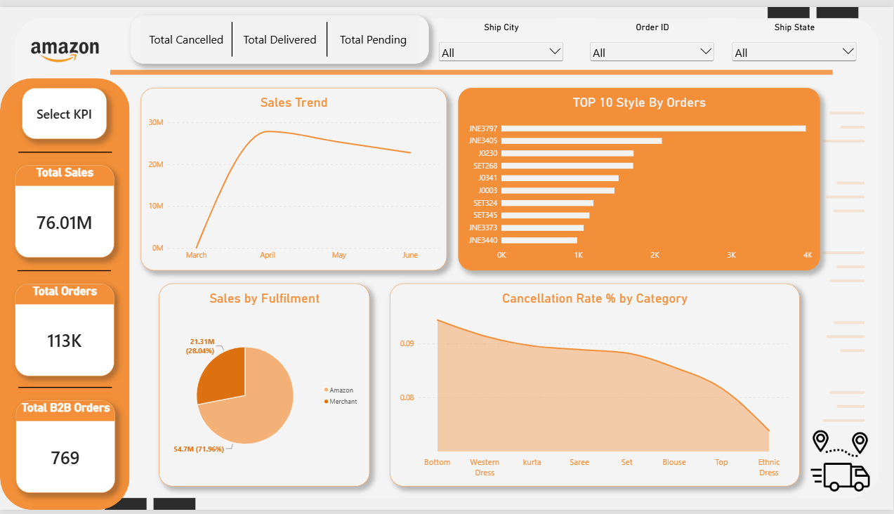
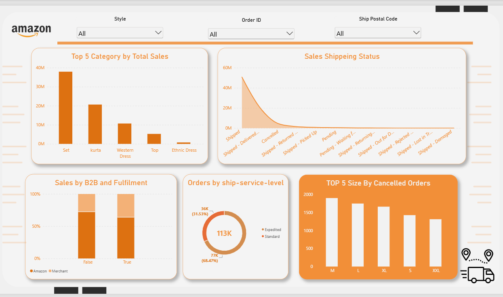

# Amazon-Sales-Analysis-PowerBI
Interactive Amazon Sales Analysis Dashboard built with Power BI, Power Query, and DAX.

## 📊 Project Overview

The dashboard analyzes sales performance, order volume, order status, fulfilment methods, cancellation rates, product categories, shipping service levels, B2B/B2C orders, and product size performance.

The main goal of this project is to transform raw sales data into meaningful business insights using data preparation, DAX measures, and interactive data visualization.

---

## 🎯 Business Questions

- How are sales changing over time?
- What is the overall sales and order performance?
- Which product categories generate the highest sales?
- What is the distribution of sales across order statuses?
- How do Amazon and Merchant fulfilment contribute to total sales?
- Which product categories have higher cancellation rates?
- Which shipping service level is used most frequently?
- How do B2B and B2C orders differ?
- Which product sizes have the highest number of cancelled orders?

---

## 🛠 Tools & Technologies

- Power BI
- Power Query
- DAX
- Microsoft Excel

---

## 📊 Dashboard Pages

### Page 1 — Amazon Sales Overview

The first page provides a high-level overview of Amazon sales and order performance.

### Page 2 — Sales & Order Analysis

The second page provides a detailed analysis of sales, shipping, fulfilment, and product performance.

---

## 💡 Key Insights

- Total sales reached approximately **76.01M**, with around **113K orders**.
- Sales peaked in **April at approximately 28M**, followed by a decline in May and June.
- **Set** was the highest-selling category, generating approximately **38M** in sales.
- Amazon fulfilment contributed approximately **54.7M**, representing about **71.96%** of total sales.
- Standard shipping accounted for approximately **68.47%** of orders.
- The cancellation rate varied across categories, with **Bottom** showing the highest rate at approximately **9.4%**.
- Among the displayed sizes, **M** had the highest number of cancelled orders.
- There were approximately **769 B2B orders**.

---

## 🖼️ Dashboard Preview

### Page 1

### Page 2

---

👩‍💻 Author

Mariam Mohamed Naiem

AI Engineering Graduate
Mansoura University
